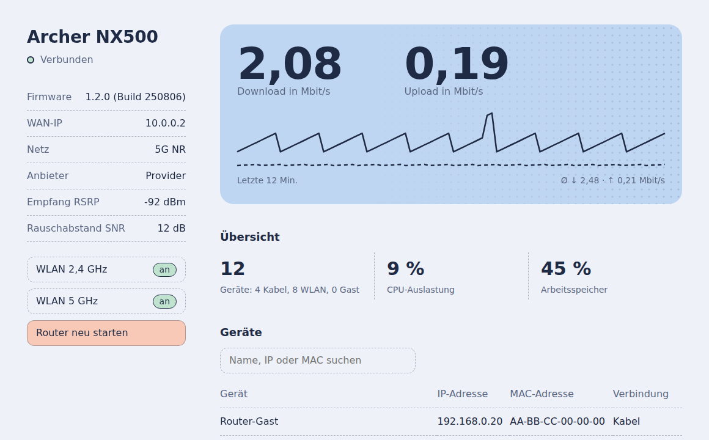

# GWAY

A lightweight, private web UI for the TP-Link Archer NX500 (5G router) as a Home Assistant add-on.

> Note: This screenshot is for demonstration purposes only and contains anonymized sample data. Personal information such as provider names, IP addresses, and device details has been replaced or hidden.

## Features

- Live traffic with history, hover details, and averages
- Overview of connected devices, CPU, memory, data usage, and 5G signal
- Data usage tile with optional monthly limit and progress bar
- Device list and static IP assignments
- Toggle Wi-Fi and guest Wi-Fi (both bands at once, or per band in the settings) and reboot the router
- Click an IP or MAC address to copy it
- Light and dark mode, including mobile support
- Settings (gear icon): language (English/German), RSRP as number or rating, optional experimental SNR display
- Optional MQTT sensors for Home Assistant (automatic discovery)

## Installation

1. In Home Assistant: Settings → Add-ons → Add-on Store → ⋮ → Repositories
2. Add `https://github.com/K0RBI02/GWAY`
   (or click: [Add repository](https://my.home-assistant.io/redirect/supervisor_add_addon_repository/?repository_url=https%3A%2F%2Fgithub.com%2FK0RBI02%2FGWAY))
3. Install GWAY, enter the router address and password in the configuration (optionally the data limit and reset day), then start it.
4. Open `http://<home-assistant-ip>:8480`.

See [src/DOCS.md](src/DOCS.md) for details and the [Changelog](src/CHANGELOG.md) for changes.

## Security

This interface has no login. It is intended for local home use only; do not expose the port to the internet.

## Notes

- Unofficial and not affiliated with TP-Link. Router access uses [`tplinkrouterc6u`](https://github.com/AlexandrErohin/TP-Link-Archer-C6U).
- Tested only with the Archer NX500. Other models may require a different client class.
- The router allows only one admin session at a time.
- The interface is available in English and German. The default follows your browser language; change it in the settings.
- The data usage counter and the traffic average are stored in the add-on's data folder and survive restarts and updates.
